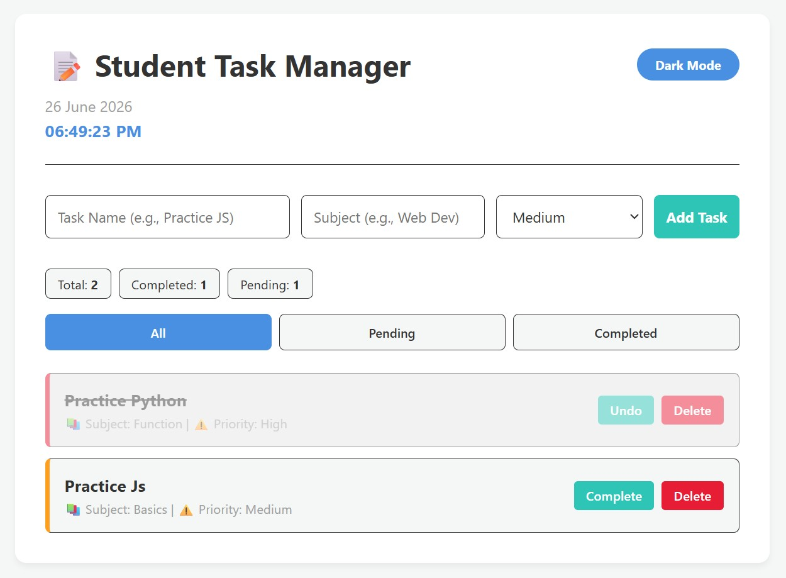

# 📚 Student Task Manager

A simple Student Task Manager (To-Do List) web application built using HTML, CSS, and JavaScript.

## 🚀 Features

- Add new study tasks
- Mark tasks as Completed
- Delete tasks
- Filter tasks:
  - All Tasks
  - Completed Tasks
  - Pending Tasks
- Task Counter:
  - Total Tasks
  - Completed Tasks
  - Pending Tasks
- Live Date & Time Display (updates every second)
- Dark Mode Toggle

## 🛠️ Technologies Used

- HTML5
- CSS3
- JavaScript (ES6)

## 📂 Project Structure

```text
Student-Task-Manager/
│
├── index.html
├── style.css
├── script.js
└── README.md
```

## 📋 Task Example

```javascript
let tasks = [
  {
    title: "Practice JavaScript",
    subject: "Web Development",
    priority: "High",
    completed: false
  }
];
```

## ▶️ How to Run

1. Download or clone this repository:

```bash
git clone https://github.com/yeaminhossainfuhad-cloud/Student_Task_Manager.git
```

2. Open the project folder.

3. Run `index.html` in your browser.

## 🎯 Project Requirements Covered

✅ Add Task

✅ Display Tasks

✅ Complete Task

✅ Delete Task

✅ Filter Tasks

✅ Task Counter

✅ Current Date & Time using `setInterval()`

✅ Dark Mode

## 📸 Screenshot

 Project here below:


## 👨‍💻 Author

**MD YEAMIN HOSSAIN FUHAD**

Student Task Manager Project

## 📄 License

This project is created for learning and educational purposes.
